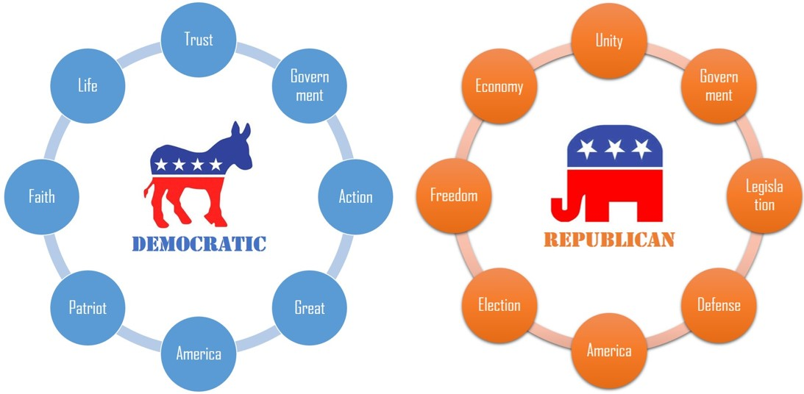

<center></center>   \n  
\n   

Presidential inauguration speech is one of the most important speeches delivered by U.S presidents during the term of office. Presidents from different eras, parties and backgrounds may be interested in different topics and have different ways of speaking. I believe by analyzing these speeches, we are definitely able to find out some interesting insights from them.\n   

\n   
In this project, I used text mining and data visualization techniques to conduct the analysis and my goal is to obtain the answers of the following questions:\n   

\n   
**1. What are the main topics that presidents from Republican and Democratic party care about respectively? Do these topics that presidents care about change across time?**\n   

\n 
**2. What are the characteristics of speeches delivered by presidents with different backgrounds?**\n  

\n   
```{r,warning=FALSE,message=FALSE,error=FALSE,echo=FALSE,include=FALSE}
packages.used=c("rvest", "tibble", "qdap", 
                "sentimentr", "gplots", "dplyr",
                "tm", "syuzhet", "factoextra", 
                "beeswarm", "scales", "RColorBrewer",
                "RANN", "tm", "topicmodels","ggplot2")

# check packages that need to be installed
packages.needed=setdiff(packages.used, 
                        intersect(installed.packages()[,1], 
                                  packages.used))
# install additional packages
if(length(packages.needed)>0){
  install.packages(packages.needed, dependencies = TRUE)
}

# load packages
library("rvest")
library("tibble")
library("qdap")
library("sentimentr")
library("gplots")
library("dplyr")
library("tm")
library("syuzhet")
library("factoextra")
library("beeswarm")
library("scales")
library("RColorBrewer")
library("RANN")
library("tm")
library("topicmodels")
library("ggplot2")

source("../lib/plotstacked.R")
source("../lib/speechFuncs.R")
```
 
```{r,warning=FALSE,message=FALSE,error=FALSE,echo=FALSE,include=FALSE}
## Get link URLs of Inauguaral speeches ##

main.page <- read_html(x = "http://www.presidency.ucsb.edu/inaugurals.php")
# f.speechlinks is a function for extracting links from the list of speeches. 
inaug.url=f.speechlinks(main.page)
#head(inaug.url)
#as.Date(inaug.url[,1], format="%B %e, %Y")
inaug.url=inaug.url[-nrow(inaug.url),] # remove the last line, irrelevant due to error.

inaug.list=read.csv("../data/InaugurationInfo.csv", stringsAsFactors = FALSE)
inaug.speech=cbind(inaug.list,inaug.url)
```
 
```{warning=FALSE,message=FALSE,error=FALSE,echo=FALSE,include=FALSE}
## Scrap the inaugural speeches from the web ##
## Do not have to run this chunk if data file has already existed

# Loop over each row in inaug.speech
inaug.speech$InauguralSpeeches=NA
for(i in seq(nrow(inaug.speech))) {
  text <- read_html(inaug.speech$urls[i]) %>% # load the page
    html_nodes(".displaytext") %>% # isloate the text
    html_text() # get the text
  inaug.speech$InauguralSpeeches[i]=text
  # Create the file name
  filename <- paste0("../data/InauguralSpeeches/", 
                     "inaug",
                     inaug.speech$File[i], "-", 
                     inaug.speech$Term[i], ".txt")
  sink(file = filename) %>% # open file to write 
  cat(text)  # write the file
  sink() # close the file
}
```
\n   
  
##PART 1: Topic Analysis\n  
  
\n  

###Q1: What are the main topics that presidents from Republican and Democratic party care about respectively?\n  

\n
To find out the answer of this question, let's prepare the data for further analysis first. The dataset for this part should include information like president's name, term, party, year and text of the inauguration speech.\n   

```{r,warning=FALSE,message = FALSE}
## Data Preparation ##

substr_year <- function(x){return(substr(x,nchar(x)-3,nchar(x)))}
inaug.year <- as.numeric(substr_year(inaug.speech$links))
inaug.data.pre <- cbind(inaug.speech[,1:5],inaug.year)

text.path <- "../data/InauguralSpeeches/"
speeches <- list.files(path = text.path, pattern = "*.txt")
n <- length(speeches)
speeches.name <- substr(speeches, 6, nchar(speeches)-4)

inaug.text<-NULL
for (i in speeches){
  New_file<-paste(scan(paste(text.path,i,sep = ""),what = "character",quiet = TRUE),collapse=" ")
  inaug.text<-rbind(inaug.text,New_file) 
}
text.out <- cbind(as.data.frame(inaug.text, stringsAsFactors = FALSE),speeches.name)

inaug.data.pre$bindname <- paste(inaug.data.pre$File,'-',inaug.data.pre$Term, sep = "")
inaug.data <- merge(inaug.data.pre, text.out, by.x = "bindname", by.y = "speeches.name")[,2:8]
names(inaug.data)[c(6,7)] <- c("Year","Inaug_Text")
```
\n   
Then I adopt topic modeling method (Latent Dirichlet Allocation (LDA)) to explore the major topics of their speeches. First I tried to functionize the LDA process, so that the LDA method can be called at any time by indicating the text to be analyzed and the name of the write-out results.\n   

```{r}
## Functionize LDA Process ##

LDA_process <- function(data, obj_name){
  docs <- Corpus(VectorSource(data))
  #remove potentially problematic symbols
  docs <-tm_map(docs,content_transformer(tolower))
  #remove punctuation
  docs <- tm_map(docs, removePunctuation)
  #Strip digits
  docs <- tm_map(docs, removeNumbers)
  #remove stopwords
  docs <- tm_map(docs, removeWords, stopwords("english"))
  #remove whitespace
  docs <- tm_map(docs, stripWhitespace)
  #Stem document
  docs <- tm_map(docs,stemDocument)
  
  dtm <- DocumentTermMatrix(docs)
  
  ##Topic Modelling by the LDA method
  
  #Set parameters for Gibbs sampling
  burnin <- 4000
  iter <- 2000
  thin <- 500
  seed <-list(2003,5,63,100001,765)
  nstart <- 5
  best <- TRUE
  
  #Number of topics
  k <- 8
  
  #Run LDA using Gibbs sampling
  ldaOut <-LDA(dtm, k, method="Gibbs", control=list(nstart=nstart, 
                                                   seed = seed, best=best,
                                                   burnin = burnin, iter = iter, 
                                                   thin=thin))
  #Write out results
  #docs to topics
  ldaOut.topics <- as.matrix(topics(ldaOut))
  write.csv(ldaOut.topics,file=paste("../output/",obj_name,"_DocsToTopics.csv",sep = ""))
  
  #top terms in each topic
  ldaOut.terms <- as.matrix(terms(ldaOut,20))
  write.csv(ldaOut.terms,file=paste("../output/",obj_name,"_TopicsToTerms.csv",sep = ""))
  
  #probabilities associated with each topic assignment
  topicProbabilities <- as.data.frame(ldaOut@gamma)
  write.csv(topicProbabilities,file=paste("../output/",obj_name,"_TopicProbabilities.csv",sep = ""))
  return(list(ldaOut.terms, topicProbabilities))
}
```
\n   
Next, let's use the LDA function above to find out the main topics that presidents from Republican and Democratic party care about respectively (speeches arranged in chronological order).\n   

```{r}
## Topic Modeling of the Republican ##

# arrange the speeches in chronological order
repub_pres <- inaug.data[inaug.data$Party == "Republican" & is.na(inaug.data$Party) == FALSE,]
repub_text_ordered <- repub_pres$Inaug_Text[order(repub_pres$Year)]

# call the LDA function
LDA_result_repub <- LDA_process(repub_text_ordered, obj_name = "Repub")
topics_repub <- LDA_result_repub[[1]]
topicProbabilities_repub <- LDA_result_repub[[2]]
#topics_repub

## Topic Modeling of the Democratic ##

# arrange the speeches in chronological order
democ_pres <- inaug.data[inaug.data$Party == "Democratic" & is.na(inaug.data$Party) == FALSE,]
democ_text_ordered <- democ_pres$Inaug_Text[order(democ_pres$Year)]

# call the LDA function
LDA_result_democ <- LDA_process(democ_text_ordered, obj_name = "Democ")
topics_democ <- LDA_result_democ[[1]]
topicProbabilities_democ  <- LDA_result_democ[[2]]
#topics_democ
```

I set the major topic numbers for each party to be 8 and manually tag them after analyzing the keywords for each topic given out by the LDA process. Following are the main topics that presidents from Republican and Democratic party care about respectively.\n   


<center></center> \n

Referring to how to settle down the topics, for example:\n   

-> I tag Republican topic 3 as ¡°Economy¡± based on the following keywords: Business, Trade, Import, Proper;\n   

-> I tag Republican topic 6 as ¡°Legislation¡± since it contains keywords: Law, Govern, Administrate, Right;\n   

-> I tag Democratic topic 2 as ¡°Government¡± because it includes keywords like: Govern, Power, Protect, Duty, Public;\n   

-> I tag Democratic topic 3 as ¡°Action¡± for the keywords like: Effort, Action, Help, Power.\n   

Based on the results of the topic modeling, we can see that the topics that presidents from Republican and Democratic party care about respectively are in line with the positioning of the two parties to some extent.\n   

As we know, Democrats are sometimes referred to as "the Party of the People," attracting immigrants, blue-collar workers, women, and minorities. They believe that the federal government should take a more active role in people's lives, particularly those who are in need. And we can see that the main topics in Democratic presidents' speeches are mostly about people and government's actions, like "Trust", "Faith", "Life", "Government", "Action", "Great"(which means make it great).\n   

On the other hand, Republicans tend to take a more conservative stand on issues. They believe that the federal government should not play a big role in people's lives. Most Republicans favor lower taxes and less government spending on social programs. They believe in less government intervention in business and the economy. We can see there is a topic called "Freedom" in Republican presidents' speeches. Besides, we cannot see a very obvious tendency of these speeches, instead, they seemed to cover every aspects that presidents need to care about in their speeches- government, economy, election, legislation, defense and also America.\n   


###Q2: Do these topics that presidents care about change across time?

To find out the answer of the second question, let's take Republican presidents' speeches as an example since the topics they cover are relatively comprehensive. Here, I use heatmap plot to see the allocation of topics for each president in Republican party across different historical periods and an interesting trend appears.\n   

```{r,warning=FALSE,message = FALSE}
## Heatmap of the topics ##

# Add topic names for "topicProbabilities" generated by LDA process
topics.hash_repub<-c("Government","Unity","Economy","Freedom","Election","Legislation","Defense","America")
names(topicProbabilities_repub)<-topics.hash_repub

# Generate heatmap of topics
heatmap.2(as.matrix(topicProbabilities_repub), Rowv = FALSE,
          scale = "column", key=F, 
          col = bluered(100),
          cexRow = 0.5, cexCol = 0.9, margins = c(8, 8),
          trace = "none", density.info = "none")
abline(h=0.52,lty = 3,lwd=2)
abline(h=0.31,lty = 1,lwd=1)
legend("topleft",legend=c("Around 1900","Around 1960"),lty = c(3,1),cex = 0.8)
```
\n   

In the heatmap, red color means the president cares more about that specific topic. From the heatmap, we can find an interesting trend, which is: presidents in same historical period tend to care about similar topics and the topics do change across time.\n   

To see this map more clearly across time, I add additional reference lines to indicate different historical period. We can see that before 1900, which are the early years of the United States, presidents liked to talk more about very fundamental and serious topics like "Election", "Unity", "Legislation" and "Economy". It does make sense because in that historical period, the nation still kept developing and these fundamental elements were not that mature and stable, so presidents wanted to show their ideas on these fundamental topics.\n   

While after 1960, the contemporary era, at this time, war had been over and severe problems had been released, presidents in this period focused more on the spiritual level, and the corresponding topics became like ¡°Freedom¡± and ¡°America¡±.\n   

And then, I extend my analysis to the overall presidents, not just the Republican party, and conduct a cluster analysis of the topics by year to see whether the preliminary findings (presidents in same historical period tend to care about similar topics and the topics do change across time) are correct or not.\n   

```{r}
# LDA modeling of all speeches and get overall probabilities associated with each topic
overall_text_ordered <- inaug.data$Inaug_Text[order(inaug.data$Year)]
topicProbabilities_overall <- LDA_process(overall_text_ordered, obj_name = "Overall")[[2]]

## Cluster Topics by Year ##

clusterdata<-as.matrix(topicProbabilities_overall)
rownames(clusterdata) <- inaug.data$Year[order(inaug.data$Year)]
fit <- kmeans(clusterdata,iter.max=200,nstart=5,5)
fviz_cluster(fit, 
             stand=F, repel= TRUE,
             data = clusterdata, xlab="", ylab = "", xaxt="n",
             show.clust.cent=FALSE)
```
\n   

From the plot, we can see that presidents from similar historical period are clustered together and the K-mean clustering provide support for our preliminary findings, which means presidents in same historical period do care about similar topics and the topics change across time.\n   

During different historical periods, America faces different challenges and Americans have different values, and presidents' inauguration speeches are good reflections of the change of era.\n   
\n   

##PART 2: Style Analysis \n   

###Q: What are the characteristics of speeches delivered by presidents with different backgrounds?\n   

According to Wikipedia "List of Presidents of the United States by education", we know that a large proportion of U.S presidents have attended law school while only a few of them have attended business school. I am very curious about the relationship between education background and the characteristics of speeches delivered by these presidents, and I am going to conduct the so-called style analysis from two aspects: length of sentences and sentiment of the speech.\n   
\n   

First, let's prepare the data for following analysis by converting the text for topic modeling in Part 1 to single sentences and obtain the emotions of these sentences by applying sentiment analysis using NRC Emotion Lexicon.\n   

```{r, message=FALSE, warning=FALSE}
## Data Preparation ##

#Convert Paragraph to Sentences and Obtain Emotions of Sentences
sentence.list=NULL
for(i in 1:nrow(inaug.data)){
  sentences=sent_detect(inaug.data$Inaug_Text[i],
                        endmarks = c("?", ".", "!", "|",";"))
  if(length(sentences)>0){
    emotions=get_nrc_sentiment(sentences)
    word.count=word_count(sentences)
    # colnames(emotions)=paste0("emo.", colnames(emotions))
    # in case the word counts are zeros?
    emotions=diag(1/(word.count+0.01))%*%as.matrix(emotions)
    sentence.list=rbind(sentence.list, 
                        cbind(inaug.data[i,-ncol(inaug.data)],
                              sentences=as.character(sentences), 
                              word.count,
                              emotions,
                              sent.id=1:length(sentences)
                              )
    )
  }
}
#head(sentence.list)

# Get rid of non-sentences
sentence.list=
  sentence.list%>%
  filter(!is.na(word.count))
```

Then I select several famous U.S presidents who have ever attended business school and law school respectively as the analysis objects:\n   

-> Among 3 presidents who attended business school, I choose two typical ones -- George W. Bush (Harvard Business School, MBA) and Donald Trump (The Wharton School, BS);\n   

-> Among so many law school presidents, I choose very famous ones -- Richard Nixon (Duke University Law School, J.D.), Bill Clinton (Yale Law School, J.D.), Barack Obama (Harvard Law School, J.D.) and Franklin D. Roosevelt (Columbia Law School, withdrew, awarded J.D. in 2008).\n   
\n   

####**Length of Sentences Analysis**\n   

Following, I conduct length of sentences analysis on the term 1 inauguration speeches from the two groups of presidents and visualize the results using bee swarm plots.\n   

```{r}
## Length of Sentences of Business School Presidents ##

# Select term 1 speech as the object of analysis
biz_president <- c("DonaldJTrump", "GeorgeWBush")
sentence.list.biz=filter(sentence.list, Term==1, File%in%biz_president)
sentence.list.biz$File=factor(sentence.list.biz$File)
sentence.list.biz$FileOrdered=reorder(sentence.list.biz$File, 
                                  sentence.list.biz$word.count, 
                                  mean, 
                                  order=T)

## Length of Sentences of Law School Presidents ##

# Select term 1 speech as the object of analysis
law_president <- c("BarackObama", "RichardNixon", "WilliamJClinton","FranklinDRoosevelt")
sentence.list.law=filter(sentence.list, Term==1, File%in%law_president)
sentence.list.law$File=factor(sentence.list.law$File)

sentence.list.law$FileOrdered=reorder(sentence.list.law$File, 
                                  sentence.list.law$word.count, 
                                  mean, 
                                  order=T)

## Generate bee swarm plots ##
par(mar=c(4,8,2,2))

beeswarm(word.count~FileOrdered, 
         data=sentence.list.biz,
         horizontal = TRUE, 
         pch=16, col=alpha(brewer.pal(3, "Set1")), 
         cex=0.55, cex.axis=0.9, cex.lab=1,
         spacing=5/nlevels(sentence.list.biz$FileOrdered),
         las=2, xlab="Number of words in a Sentence", ylab="",
         main="Inauguration Speeches (Business School Presidents)",xaxt="n")
axis(1,at=seq(0,80,10))

beeswarm(word.count~FileOrdered, 
         data=sentence.list.law,
         horizontal = TRUE, 
         pch=16, col=alpha(brewer.pal(4, "Set1")), 
         cex=0.6, cex.axis=0.9, cex.lab=1,
         spacing=5/nlevels(sentence.list.law$FileOrdered),
         las=2, xlab="Number of words in a Sentence", ylab="",
         main="Inauguration Speeches (Law School Presidents)",xaxt="n")
axis(1,at=seq(0,80,10))
```

According to the bee swarm plots, we can intuitively find that presidents with business school background tended to use relatively shorter sentences, most of the sentences are below 20 words; while presidents with law school background liked to use longer sentences, the distribution of the length of sentences are relatively even in each bin from 0 to 30.\n   

Next, let's check our intuitive findings from the statistical point of view using boxplots.\n   

```{r}
## Data preparation for drawing boxplots ##

# Merge relevant data
new_df_biz <- sentence.list.biz[,c("President","Term","word.count")]
new_df_biz$School <- c("Business")
new_df_law <- sentence.list.law[,c("President","Term","word.count")]
new_df_law$School <- c("Law")
new_combine <- rbind(new_df_biz,new_df_law)

# Denote each president by last name in the boxplots
name.split.func <- function(x){return(strsplit(x, split = " ")[[1]][3])}
new_combine$LastName <- apply(data.frame(new_combine[,1]),1,name.split.func)
new_combine$LastName[new_combine$President == "Barack Obama"] <- "Obama"
new_combine$LastName[new_combine$President == "Richard Nixon"] <- "Nixon"

# Draw boxplots using ggplot
ggplot(new_combine, aes(x=LastName, y=word.count))+
  geom_boxplot(aes(fill = School))+
  labs(title = "Inauguration Speeches Length of Sentences Comparison", x = "Presidents", y = "Words Per Sentence")

# Average length of sentences of biz vs law
round(mean(sentence.list.biz$word.count))
round(mean(sentence.list.law$word.count))
```
\n   

From these boxplots, we can see that the length of sentences median of law school background presidents is mostly higher than those two graduated from business school, and their distribution seems to be more spread out, not very concentrated on 10 to 20 words per sentence, which supports our previous findings that presidents with law school background liked to use longer sentences than business school background presidents. The average length of sentences for the business group is 15 versus 18 in law group.\n   
\n   

####**Sentiment Analysis**\n   

Apart from the sentence length, I also want to know what kind of emotions they would like to convey during their speech. Therefore, next, I try to identify the major emotions included in their speeches through the sentiment analysis.\n   

The basis of the sentiment analysis is NRC Emotion Lexicon which associates English words with 8 basic emotions (anger, fear, anticipation, trust, surprise, sadness, joy, and disgust). Based on the emotions identified for each sentence in the data preparation part above, I summarize them and use bar plots to visualize the results.\n   

```{r}
par(mar=c(4, 6, 2, 1))
emo.means=colMeans(select(sentence.list.biz, anger:trust)>0.01)
col.use=c("red2", "darkgoldenrod1", 
            "chartreuse3", "blueviolet",
            "darkgoldenrod2", "dodgerblue3", 
            "darkgoldenrod1", "darkgoldenrod1")
barplot(emo.means[order(emo.means)], las=2, col=col.use[order(emo.means)], horiz=T, main="Inauguration Speeches (Business School Presidents)")

emo.means=colMeans(select(sentence.list.law, anger:trust)>0.01)
col.use=c("red2", "darkgoldenrod1", 
            "chartreuse3", "blueviolet",
            "darkgoldenrod2", "dodgerblue3", 
            "darkgoldenrod1", "darkgoldenrod1")
barplot(emo.means[order(emo.means)], las=2, col=col.use[order(emo.means)], horiz=T, main="Inauguration Speeches (Law School Presidents)")
```
\n   

Apparently, no matter what background the presidents have, they definitely wanted to convey positive sentiments to the public in the inauguration speeches like "Trust", "Joy" and "Anticipation". However, we can still find out some differences regarding to the emotions in their speeches between business school background and law school background presidents.\n   

In terms of the positive sentiments, law background presidents conveyed more anticipation than joy, while business background presidents are reversed. And law background presidents conveyed more negative emotions than the business background ones, in which fear, sadness and anger take a considerable proportion.\n   

According to findings above, we know that longer sentences and more mixed emotions in the inauguration speeches are associated with presidents who have law school background. A possible explanation I think is that those presidents who studied in law school for several years tend to be more rational, conscientious and considerate. So even at the moment of inauguration, a milestone in their life, they maybe still expressed concerns on the possible challenges and potential difficulties that the nation was facing. On the other hand, presidents with business school background seemed to be more optimistic.\n   
\n   

<font size=2>
**Reference:**\n   

[1] Presidents Image: http://inauguratespeeches.com/ \n   

[2] Article: "What Do Parties Stand For?" http://www.scholastic.com/browse/article.jsp?id=4706 \n   
    
[3] Wikipedia: "List of Presidents of the United States by education" https://en.wikipedia.org/wiki/List_of_Presidents_of_the_United_States_by_education \n   
    